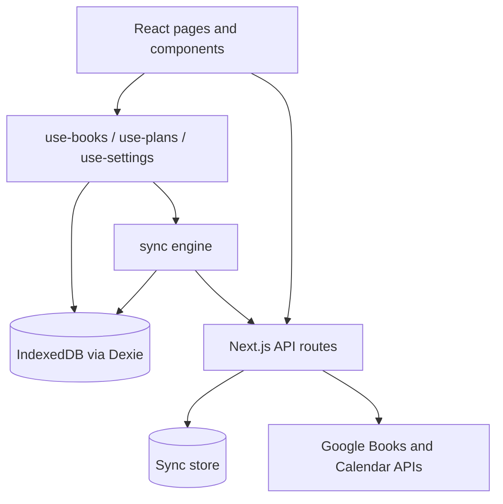

# Architecture

Reading Scheduler is a **client-first** Next.js application. Books, plans, and daily assignments live in the browser via IndexedDB (Dexie) and sync to the server when signed in with Google.

## Data flow

- **No server actions** — all CRUD goes through client hooks into Dexie.
- **Reactive reads** — `useLiveQuery` keeps UI in sync with IndexedDB.
- **Atomic writes** — plan saves and regenerations use Dexie transactions.
- **Cloud sync** — signed-in users push/pull via `/api/sync`; conflicts resolve per record by newest `updatedAt`.

## Cloud sync

- **Sign-in** — Google OAuth (`openid email profile`) creates a signed `user_session` cookie alongside existing Calendar tokens.
- **Local-first** — IndexedDB remains the offline cache; changes debounce-push to the server after writes.
- **Pull** — on app load, tab focus, and manual “Sync now” in Settings.
- **Merge** — `src/lib/sync/merge.ts` merges bundles by record id; tombstones track deletions.
- **Storage** — per-user JSON snapshots under `SYNC_DATA_DIR` (see README).

## Scheduler pipeline

Pure TypeScript under `src/lib/scheduler/`:

1. **`computeBookWindows`** (`layouts.ts`) — per-book date windows from layout mode (parallel, sequential, custom).
2. **`generateAllAssignments`** (`generate.ts`) — daily page ranges per window.
3. **`buildFullSchedule`** (`preview.ts`) — preview segments + feasibility check.
4. **`buildScheduleFromDate`** (`regenerate.ts`) — rebuild remaining assignments from a new start date using current progress.

## Calendar export

- **ICS download** — generated client-side (`src/lib/calendar/ics.ts`).
- **Google Calendar** — client sends assignments to `POST /api/calendar/export`; server upserts events using stable `iCalUID` values (`src/lib/calendar/events.ts`) so re-export updates existing events instead of duplicating them.
- **Subscription feed** — `POST /api/calendar/feed` stores a plan snapshot server-side and returns a subscribe URL. `GET /api/calendar/feed/[token]` serves a live `.ics` document with `X-PUBLISHED-TTL:PT1H` so calendar apps can refresh. Re-publishing (or recalculating a plan with an existing feed token) bumps event `SEQUENCE` numbers for the same stable UIDs. Feed snapshots persist under `FEED_DATA_DIR` (see README).
- **Deletion** — `POST /api/calendar/delete` removes events by `iCalUID` when a plan is deleted with the calendar cleanup option. Published feeds are revoked when a plan with a feed token is deleted.

## Key entities

| Entity | Purpose |
|--------|---------|
| `Book` | Library item with optional `status` (want-to-read / reading / finished) |
| `ReadingPlan` | Plan metadata, rhythm, and status (active / completed / archived) |
| `PlanBook` | Join table with per-book schedule windows |
| `DailyAssignment` | One reading session: date, page range |
| `AppSettings` | Defaults, timezone, sound prefs, plan templates |
| `DeletedRecord` | Local tombstone for sync deletes |

## Backup and restore

`exportData` / `importData` in `src/lib/db/export-import.ts` produce versioned JSON bundles. Import supports **merge** (default) or **replace** strategies. Cloud sync reuses the same bundle format.
